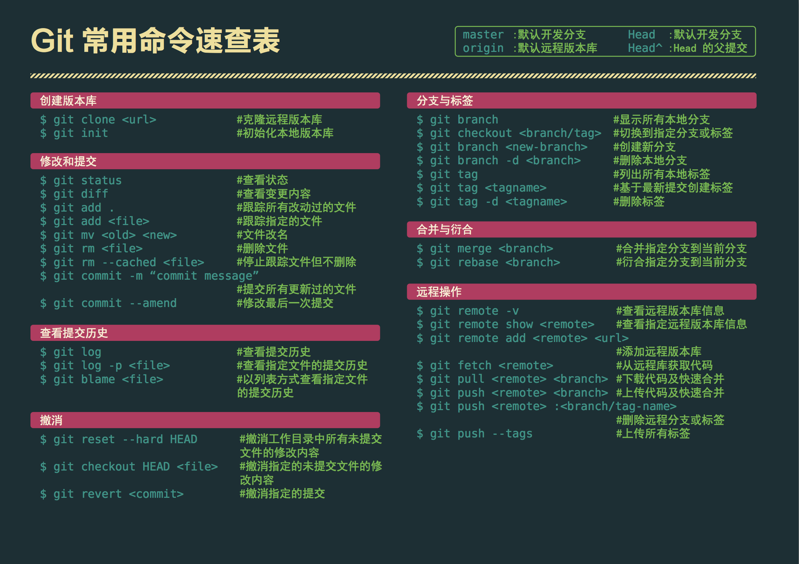

# Hello GitHub

本文内容：

- **Git安装**
- **Git常用命令**
- **GitHub进阶用法**
- **日常debug总结**

---

## 1. git与github

### 1.1 git的安装

下载：[Git Download](https://git-scm.com/)

安装：[Git 详细安装教程](https://blog.csdn.net/mukes/article/details/115693833)

---

### 1.2 github的使用

注册：[GitHub](https://github.com/)

创建仓库：[New repository](https://github.com/new)

---

### 1.3 SSH绑定

将本地与GitHub进行SSH绑定。

1. 生成随机密钥。

```bash
ssh-keygen -t rsa -C “xxx@gamil.com”
```

> 必须对应github账号注册邮箱。


2. 将`id_rsa.pub`文件内容添加到[SSH and GPG keys](https://github.com/settings/keys)。

3. 配置全局用户信息。

```bash
git config --global user.name “lancit”
git config --global user.email “xxx@gamil.com”
```

> name随意，但推荐与GitHub一致；
>
> email必须与GitHub注册邮箱相同。


4. 测试：

```bash
ssh -T git@github.com
```

---

## 2. git常用命令



### 2.1 创建版本库

#### 2.1.1 git clone

`clone`远程仓库到本地指定路径：

```bash
git clone <repository-url> <local-directory>
```

`clone`仓库**特定分支副本**：

```bash
git clone --branch branch1 <repository-url>
```

`clone`仓库**特定标签副本**：

```bash
git clone --branch v1.0.0 <repository-url>
```

`clone`仓库**特定提交副本**，选项为**哈希值**：

```bash
git clone --branch 4c4ba1d <repository-url>
```

`clone`仓库**子目录副本**，要使用`--depth`和`--filter`选项：

```bash
git clone --depth 1 --filter=blob:none <repository-url> subdirectory
```

> 克隆`repository-url`仓库下 一级子目录`subdirectory`副本。

---

#### 2.1.2 git init

初始化一个新的Git仓库：

```bash
git init <Options> <local-directory>
```

- `--bare`：初始化一个裸 Git 仓库，即没有工作目录的仓库。裸仓库通常用作协同目的的集中仓库。
- `--template=<template_directory>`：指定一个目录来初始化 Git 仓库。可以使用此选项来为仓库提供自定义模板。
- `--separate-git-dir=<git_directory>`：在指定的目录中初始化仓库，但将 Git 元数据存储在单独的目录中。当工作目录在单独的文件系统上或者与他人共享仓库时，这很有用。

---

### 2.2 修改与提交

#### 2.2.1 git status

查看**工作区**和**暂存区**状态：

```bash
git status
```

----

#### 2.2.2 git diff

查看**工作区**和**暂存区**的差异：

```bash
git diff
```

查看**分支**差异：

```bash
git diff branch1 branch2
```

查看单个文件的差异：

```bash
git diff <file>
```

查看**两次提交的差异**（哈希值，用`git log --oneline`）：

```bash
git diff a1b2c3d4 e5f6g7h8
```

**生成差异补丁文件**：

```bash
git diff > patch.diff
```

**忽略特定文件**：

```bash
git diff -- . ":(exclude)*.log"
```

**查看合并冲突前的版本差异**：

```bash
git diff --base
```

**查看合并中”我们“的版本差异**：

```bash
git diff --ours
```

**查看合并中”他们“的版本差异**：

```bash
git diff --theirs
```

**常用选项：**

| 选项                    | 作用                               |
| :---------------------- | :--------------------------------- |
| `--cached` / `--staged` | 比较暂存区和上次提交之间的差异     |
| `--name-only`           | 仅显示修改的文件名                 |
| `--name-status`         | 显示修改文件的状态和文件名         |
| `--stat`                | 显示统计信息（增删行数、文件数量） |
| `-w`                    | 忽略空白字符的差异                 |
| `-U<n>`                 | 设置上下文行数                     |

---

#### 2.2.3 git add

添加单个文件：

```bash
git add <file>
```

添加指定目录下的变更文件：

```bash
git add <directory>
```

 使用**交互模式**添加：

```bash
git add -i
```

- 进入交互模式，允许选择性地暂存文件的更改。
- 在交互模式下，可以执行以下操作：
  - `status`：查看当前更改。
  - `update`：将**工作区**变化更新到**暂存区**。
  - `revert`：**撤销对暂存区的更改，并回退到上次提交版本**。
  - `patch`：逐行选择暂存内容。

**分块添加文件更改**：

```bash
git add -p
```

- 以交互模式逐块（hunk）选择文件的更改。
- 提供选项：
  - `y`：暂存当前块。
  - `n`：跳过当前块。
  - `q`：退出分块添加模式。
  - `s`：分割当前块。
  - `e`：手动编辑当前块。

 **常用选项：**

| 选项                   | 功能                                                   |
| ---------------------- | ------------------------------------------------------ |
| `.`                    | 添加当前目录下的所有更改，包括新增、修改和删除的文件。 |
| `-A` / `--all`         | 添加当前工作区的所有更改，包括新增、修改和删除的文件。 |
| `-u` / `--update`      | 仅添加已跟踪文件的更改或删除的文件，不包括新增文件。   |
| `-p` / `--patch`       | 分块模式逐块选择更改进行暂存。                         |
| `-i` / `--interactive` | 进入交互模式，选择性暂存文件和更改。                   |
| `--ignore-errors`      | 忽略无法添加的文件错误，继续处理其他文件。             |
| `--dry-run`            | 显示将被暂存的文件，但不实际添加到暂存区。             |
| `--force` / `-f`       | 强制添加被 `.gitignore` 忽略的文件。                   |

---

#### 2.2.4 git mv

重命名文件：

```bash
git mv old_filename new_filename
```

移动文件到指定目录下：

```bash
git mv <file> <directory>
```

移动文件到指定目录下并重命名：

```bash
git mv <source> <destination>
```

---

#### 2.2.5 git rm

删除**工作区文件**：

```bash
git rm <file>
```

删除指定目录及其文件：

```bash
git rm -r <directory>
```

**只停止追踪，但保留文件**：

```bash
git rm --cached config.json
```

 **常用选项**：

| 选项                 | 功能                                       |
| -------------------- | ------------------------------------------ |
| `--cached`           | 停止跟踪文件，但保留文件在工作区中。       |
| `-r` / `--recursive` | 递归删除目录及其内容。                     |
| `-f` / `--force`     | 强制删除文件，即使工作区中有未保存的修改。 |
| `-n` / `--dry-run`   | 显示将被删除的文件，但不实际执行删除操作。 |

---

#### 2.2.6 git commit

提交**暂存区**的更改：

```bash
git commit -m "Fixed bug"
```

直接提交所有更改到**暂存区**，并提交：

```bash
git commit -a -m "INFO"
```

**交互式提交**：

```bash
git commit --interactive
```

**逐块提交**：

```bash
git commit --patch
```

 **常用选项**：

| 选项                        | 功能                                                     |
| --------------------------- | -------------------------------------------------------- |
| `-m <message>`              | 添加提交信息。                                           |
| `-a`                        | 跳过 `git add`，自动将所有已跟踪文件的更改添加到暂存区。 |
| `--amend`                   | 修改最近一次提交（包括提交信息或内容）。                 |
| `--no-edit`                 | 使用最近一次提交的消息，不编辑提交信息。                 |
| `--allow-empty`             | 提交一个空的提交（没有文件更改）。                       |
| `--author="<name> <email>"` | 为提交指定作者。                                         |
| `--date=<date>`             | 指定提交的日期。                                         |
| `--dry-run`                 | 显示将被提交的内容，但不实际执行提交。                   |

---

### 2.3 撤消

`HEAD`：**指向当前分支的最新提交**。

**特点**：

1. **动态变化**：
   - 每次提交新的更改（`git commit`），`HEAD` 会自动移动到新的提交位置。
   - 如果切换分支（`git checkout branch_name`），`HEAD` 会指向该分支的最新提交。
2. **当前分支指针**：
   - 在正常情况下，`HEAD` 是指向当前分支（如 `main` 或 `feature` 分支）的指针。
3. **分离状态**：
   - 如果 `HEAD` 直接指向某个特定的提交而不是分支，这种状态称为“分离 HEAD”（Detached HEAD）

---

#### 2.3.1 git reset

基本语法：

```bash
git reset [options] [<commit>]
```

- `<commit>`：指定需要重置到的目标提交。如果不提供，默认为 `HEAD`。

- `[options]`：控制重置范围（`--soft`、`--mixed`、`--hard`）。

| 模式      | 描述                                                         | 暂存区 | 工作区 |
| :-------- | ------------------------------------------------------------ | ------ | ------ |
| `--soft`  | 重置到指定提交，只改变 HEAD 指向，不影响暂存区和工作区的内容。 | 保留   | 保留   |
| `--mixed` | 重置到指定提交，改变 HEAD 和暂存区，取消暂存的更改，但保留工作区的内容。 | 重置   | 保留   |
| `--hard`  | 重置到指定提交，改变 HEAD、暂存区和工作区，所有更改（已提交或未提交）都会被丢弃。 | 重置   | 重置   |

**撤销文件的暂存**：

```bash
git reset <file>
```

撤销本地所有未提交的更改：

```bash
git reset --hard
```

撤销本地所有文件的修改，**但不删除新文件**：

```bash
git restore <file>
```

**重置暂存区和工作区到特定提交**：

```bash
git reset --hard <commit_hash>
```

撤销最近一次的提交，将提交更改放回暂存区，不影响工作区文件：

```bash
git reset --soft HEAD~1
```

- `HEAD~1`：表示上一个提交。

撤销最近一次的提交，**不保留提交更改到暂存区**，不影响工作区文件：

```bash
git reset --mixed HEAD~1
```

撤销最近一次提交，**同时清空暂存区和工作区的更改**，恢复到上一次提交的状态:

```bash
git reset --hard HEAD~1
```

**查看重置状态**;

- 查看HEAD指向：`git log`

- 查看**工作区**和**暂存区**状态：`git status`

---

#### 2.3.2 git revert

与 `git reset` 不同，**它不会直接删除提交历史，而是通过创建一个新的提交来逆转指定提交的改动**。

基本语法：

```bash
git revert [options] <commit>
```

- `<commit>`：指定需要撤销的提交（通常是提交哈希 `commit_hash`）。

- `[options]`：指定行为的附加选项（如静默模式等）。


撤销某次提交：

```bash
git revert <commit>
```

撤销最近一次提交：

```bash
git revert HEAD
```

撤销**多个提交**，按顺序撤销：

```bash
git revert <commit1> <commit2>
```

撤销一系列提交，从父提交`start_commit`到`end_commit`：

```bash
git revert <start_commit>^..<end_commit>
```

**常用选项**：

| 选项                 | 功能                                                 |
| -------------------- | ---------------------------------------------------- |
| `-n` / `--no-commit` | 逆转提交，但不立即创建新的提交，改动保留在暂存区中。 |
| `--continue`         | 在冲突解决后继续完成 `revert` 操作。                 |
| `--abort`            | 取消当前的 `revert` 操作。                           |
| `--no-edit`          | 不进入编辑模式，直接使用默认的提交信息。             |

----

#### 2.3.3 git checkout

恢复文件到最近提交状态：

```bash
git checkout HEAD index.html
```

恢复文件到某次提交状态：

```bash
git checkout <commit_hash> <file>
```

查看历史提交内容，会**将HEAD指向某次提交，进入分离状态**：

```bash
git checkout <commit_hash>
```

---

### 2.4 分支与标签

#### 2.4.1 git branch

查看**本地分支**和**远程分支**：

```bash
git branch
git branch -r
git branch -a
```

创建新分支、创建新分支并切换到该分支：

```bash
git branch <branch_name>
git checkout -b <branch_name>
```

切换分支：

```bash
git checkout <branch_name>
```

删除本地分支：

```bash
git branch -d <branch_name>
```

删除远程分支：

```bash
git push origin --delete <branch_name>
```

重命名分支：

```bash
git branch -m <old_branch_name> <new_branch_name>
```

设置分支的上游分支：

```bash
git branch --set-upstream-to=origin/<branch_name>
```

查看分支的提交历史：

```bash
git log <branch_name>
```

创建与某个提交相关的分支：

```bash
git log <branch_name>
```

---

#### 2.4.2 git tag

查看标签的详细信息：

```bash
git show <tag_name>
```

查看所有标签、查看**带有详细信息的标签**：

```bash
git tag
git tag -n
```

创建轻量标签（不带元数据，即注释）的标签：

```bash
git tag <tag_name>
```

创建**带注释**的标签：

```bash
git tag -a <tag_name> -m "your message"
```

创建**带注释的标签，并指向特定提交**的标签：

```bash
git tag -a <tag_name> <commit_id> -m "your message"
```

删除本地标签：

```bash
git tag -d <tag_name>
```

删除远程标签：

```bash
git push origin --delete <tag_name>
```

推送标签到远程仓库、推送所有标签到远程仓库：

```bash
git push origin <tag_name>
git push --tags
```

---

### 2.5 合并与衍合

#### 2.5.1 git merge

将`branch_name`合并到当前分支，自动处理冲突：

```bash
git merge <branch_name>
```

**合并分支时创建新的合并提交分支**，保留历史提交：

```bash
git merge --no-ff <branch_name>
```

快速合并，**不提交新的合并分支**：

```bash
git merge --ff <branch_name>
```

解决**合并冲突**：

```bash
git add <file>
git commit
```

查看合并历史：

```bash
git log --graph --oneline
```

---

#### 2.5.2 git rebase

解释：它通过将分支的基础修改为另一个分支的最新提交，使提交历史更清晰和线性。

例子：假设 `feature` 分支的基础是 `main` 的某个早期提交，变基后它的基础将更新为 `main` 分支的最新提交。

**操作前历史：**

```css
A---B---C (main)
     \
      D---E---F (feature)
```

**变基操作：**

```bash
git checkout feature
git rebase main
```

**变基后历史：**

```css
A---B---C (main)
             \
              D'---E'---F' (feature)
```


将`feature`分支的**基**更改为`main`的最新提交：

```bash
git checkout feature
git rebase main
```

**交互式变基**：

```bash
git rebase -i <base_branch>
```

**常用选项**：

| 命令                    | 功能说明                                             |
| ----------------------- | ---------------------------------------------------- |
| `git rebase <branch>`   | 将当前分支变基到指定分支。                           |
| `git rebase -i`         | 交互式变基，允许修改提交的顺序或内容。               |
| `git rebase --continue` | 继续上一次因冲突暂停的变基操作。                     |
| `git rebase --abort`    | 取消当前变基操作，恢复到变基前的状态。               |
| `git rebase --skip`     | 跳过当前提交并继续变基（当某个提交可以忽略时使用）。 |

---

### 2.6 远程操作

#### 2.6.1 git remote

查看远程仓库、查看远程仓库的详细信息、查看仓库的配置信息：

```bash
git remote
git remote -v
git remote show <name>
```

**添加远程仓库到本地仓库**，`name`：仓库名称，`url`：仓库网址：

```bash
git remote add <name> <url>
```

**修改远程仓库的`url`**：

```bash
git remote set-url <name> <new_url>
```

删除远程仓库：

```bash
git remote remove <name>
```

---

#### 2.6.2 git fetch

解释：只会下载远程仓库中的数据，更新本地的远程跟踪分支，用户需要手动进行合并。

获取远程仓库的所有更新：

```bash
git fetch
```

获取仓库所有的更新：

```bash
git fetch --all
```

获取指定仓库的更新：

```bash
git fetch <remote_name>
```

获取指定分支的更新：

```bash
git fetch <remote_name> <branch_name>
```

获取**并删除本地中远程仓库已经删除的分支**：

```bash
git fetch --prune
```

获取所有远程仓库的标签：

```bash
git fetch --tags
```

`git fetch` 和 `git pull` 的区别：

- `git fetch` 仅仅是获取远程仓库的更新数据，不会自动合并到当前工作分支。
- `git pull` 是 `git fetch` + `git merge` 的组合，执行完 `fetch` 后，它会自动合并更新到当前分支。

---

#### 2.6.3 git pull

拉取指定仓库中的特定分支更新，并合并：

```bash
git pull <remote_name> <branch_name>
```

**拉取并进行`rebase`操作**：

```bash
git pull --rebase
```

拉取**仅获取数据，不进行合并**，该过程暂停，需要手动检阅：

```bash
git pull --no-commit
```

---

#### 2.6.4 git push

推送指定分支到远程仓库：

```bash
git push <remote_name> <branch_name>
```

推送本地所有分支到远程仓库：

```bash
git push --all <remote_name>
```

**推送标签**：

```bash
git push <remote_name> <tag_name>
```

**强制推送**：

```bash
git push --force
```

> 此命令强制推送本地分支到远程仓库，覆盖远程仓库中的内容。**注意**，使用 `--force` 会覆盖远程分支的历史，这可能导致其他开发者的提交丢失，应该谨慎使用。常见的情况是，当你进行了 `git rebase` 或者修正了提交历史，且希望远程分支的历史与本地分支一致时，使用 `--force` 进行强制推送。


推送，并删除远程分支：

```bash
git push <remote_name> --delete <branch_name>
```

设置上游分支，**关联本地分支到远程分支上**：

```bash
git push --set-upstream <remote_name> <branch_name>
```

---

## 3. git进阶用法

- 

---

## 4. 日常debug总结

### 4.1 新建repo

```bash
echo "# test" >> README.md
git init
git add README.md
git commit -m "first commit"
git branch -M main
git remote add origin https://github.com/lancitx/test.git
git push -u origin main
```

---

### 4.2 将本地repo绑定远程repo

```bash
git remote add origin https://github.com/lancitx/test.git
git branch -M main
git push -u origin main
```

---

### 4.3 屏蔽某文件/目录

在`repo`根目录：

```bash
echo "myfile_or_dir/" >> .gitignore
```

再确保取消 `Git` 对该文件/目录的追踪：

```bash
git rm -r --cached myfile_or_dir/
```

提交更改：

```bash
git add .gitignore
git commit -m "Update .gitignore to exclude myfile_or_dir"
```

推送远程仓库：

```bash
git push
```

---

### 4.4 撤销`--hard`操作

当你把 `git reset --soft HEAD~1` 输成 `git reset --hard HEAD~1` 时，如果你有提交备份，则可以：

```bash
git reflog
```

信息输出：

```bash
5fdc6fb (HEAD -> main) HEAD@{0}: reset: moving to HEAD@{2}
5fdc6fb (HEAD -> main) HEAD@{1}: reset: moving to HEAD@{1}
b62e1cf (origin/main, origin/HEAD) HEAD@{2}: reset: moving to HEAD~1
5fdc6fb (HEAD -> main) HEAD@{3}: commit: update
b62e1cf (origin/main, origin/HEAD) HEAD@{4}: clone: from https://github.com/lancitx/FreeRTOS.git
```

然后，**撤销到特定提交：**

```bash
git reset --hard HEAD@{2}
```

**如果有些文件尚未提交：**

```bash
git fsck --lost-found
```

---

### 4.5 Git代理

查看`Git`代理：

```bash
git config --global --get http.proxy
git config --global --get https.proxy
```

只对 `https://github.com/lancitx/FreeRTOS.git/` 仓库进行代理：

```bash
git config --global http.https://github.com.proxy socks5://127.0.0.1:7897
```

取消代理：

```bash
git config --global --unset http.https://github.com.proxy
```

对所有仓库设置代理：

```bash
git config --global http.proxy 'socks5://127.0.0.1:7897'
git config --global https.proxy 'socks5://127.0.0.1:7897'
```

取消代理：

```bash
git config --global --unset http.proxy
git config --global --unset https.proxy
```

